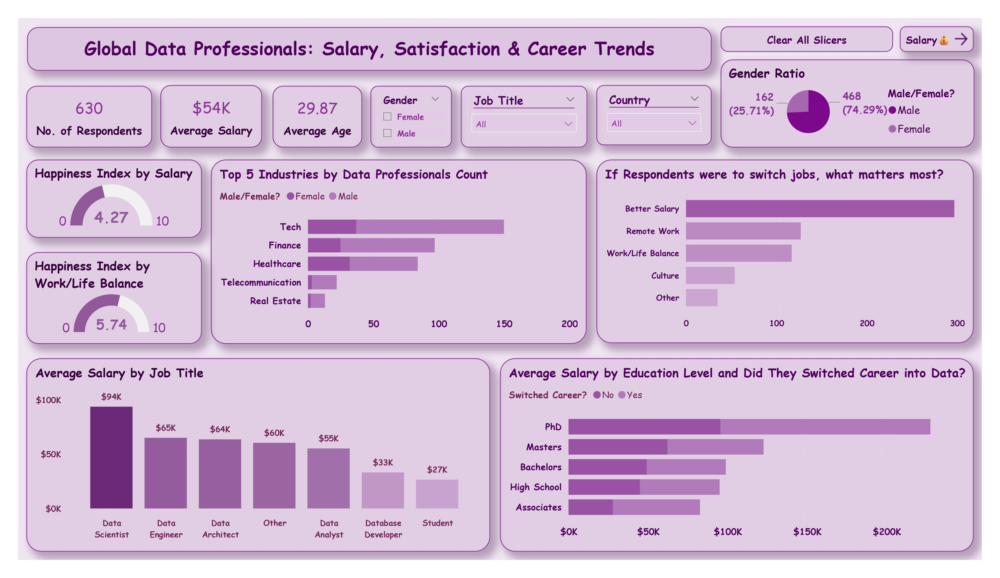
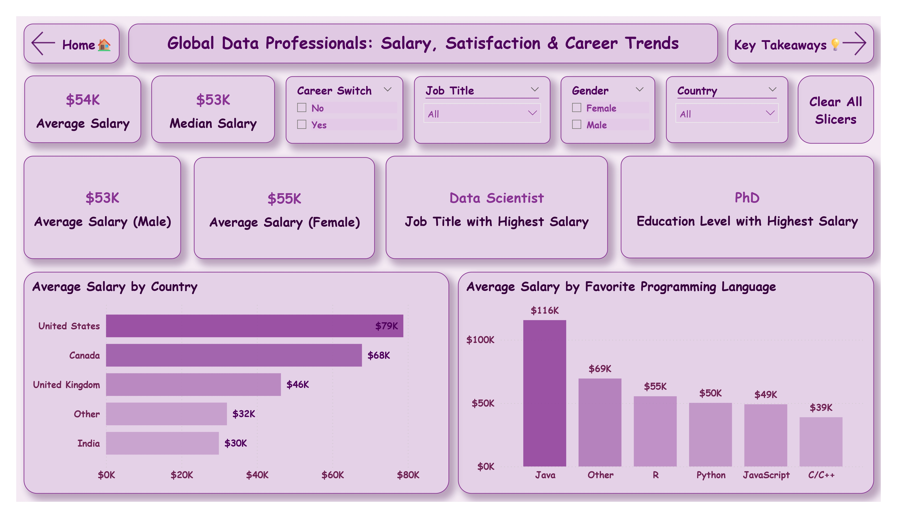
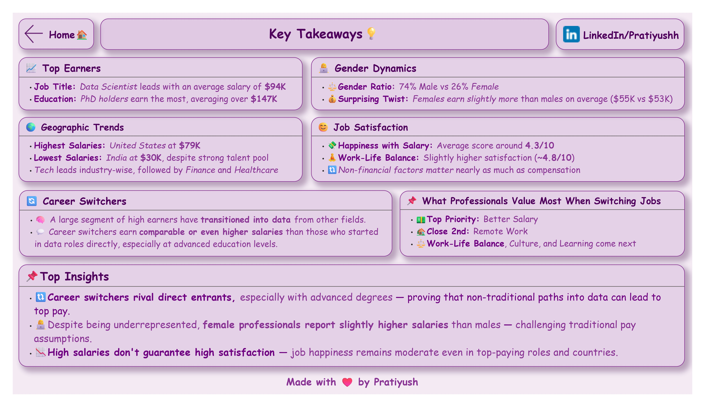

# 💼 Global Data Professionals – Salary, Satisfaction & Career Trends
## Strategic Workforce Intelligence Dashboard

📌 *Power BI dashboard analyzing 630+ global data professionals*  
📌 *Executive insights for HR strategy, compensation planning, and talent retention*

---

## 🎯 **Project Goal**

Analyze comprehensive survey data from global data professionals to provide **HR executives, talent acquisition leaders, and workforce strategists** with actionable intelligence on compensation benchmarks, career mobility patterns, and retention drivers in the data industry.

**Primary Business Questions:**
- What roles and education levels command premium compensation?
- How do career switchers perform compared to direct entrants?
- What factors drive job satisfaction and career moves?
- Are gender compensation gaps present across roles and experience levels?

---

## 📊 **Key Strategic Insights**

### **💰 Compensation Intelligence**
- **Top Earners:** Data Scientists lead at **$94K average salary** (highest premium role)
- **Role Hierarchy:** Data Engineer ($65K) → Data Architect ($64K) → Data Analyst ($55K)
- **Entry vs. Premium:** 248% salary gap between Students ($27K) and Data Scientists ($94K)
- **Education Premium:** PhD holders command **$147K median** (57% above average)

### **🌍 Geographic Salary Intelligence**  
- **Market Leaders:** United States dominates at **$79K average salary**
- **Secondary Markets:** Canada ($68K), United Kingdom ($46K) show competitive rates
- **Emerging Markets:** India ($30K) despite strong talent pool concentration
- **Strategic Arbitrage:** 163% salary difference between US and Indian markets

### **👩‍💻 Gender & Diversity Analysis**
- **Gender Distribution:** 74.3% Male (468) vs 25.7% Female (162) professionals
- **Compensation Equity:** Female professionals earn **$55K vs Male $53K** (4% premium)
- **Career Advancement:** Gender parity in salary progression challenges traditional assumptions
- **Strategic Opportunity:** Diversity recruitment without compensation penalty risk

### **🔄 Career Mobility & Technology Trends**
- **Programming Language Premium:** Java leads at **$116K average** (116% above baseline)
- **Career Switcher Success:** Comparable earnings to direct entrants, especially with advanced education
- **Technology Stack Value:** Python ($50K), R ($55K), JavaScript ($49K) show market differentiation
- **Industry Concentration:** Tech sector leads, followed by Finance and Healthcare

### **😊 Satisfaction vs Compensation Analysis**
- **Salary Satisfaction:** **4.27/10 average** despite competitive compensation
- **Work-Life Balance:** Higher satisfaction at **5.74/10** indicates non-monetary priorities
- **Job Switch Motivators:** Better Salary, Remote Work, Work-Life Balance drive career moves
- **Retention Insight:** High compensation doesn't guarantee satisfaction or loyalty

---

## 📸 **Executive Dashboard Overview**

### **🏠 Strategic Workforce Intelligence Center**

*Executive KPIs: Average age 29.87, gender distribution, happiness indices, and strategic workforce metrics*

### **💰 Compensation Benchmarking Intelligence**  

*Role-based salary analysis: Data Scientist ($94K), geographic variations, education impact, and programming language value*

### **🧠 Career Strategy & Satisfaction Insights**  

*Career switcher success analysis, job satisfaction drivers, and retention strategy recommendations*

---

## 🎯 **Strategic Workforce Recommendations**

### **1. Compensation Strategy Optimization**
- **Premium Role Investment:** Data Scientist positions justify 70% salary premium over analysts
- **Education Recognition:** Structure PhD compensation at 175%+ above baseline for talent attraction
- **Geographic Arbitrage:** Leverage 163% US-India salary differential for cost optimization
- **Technology Specialization:** Java skills command 132% premium - prioritize in hiring/training

### **2. Talent Acquisition & Retention Strategy**
- **Career Switcher Programs:** Develop structured onboarding - comparable performance to direct hires
- **Diversity Initiative:** Leverage existing gender pay equity to drive representation goals
- **Non-Monetary Focus:** Remote work and work-life balance rival salary in retention importance  
- **Industry Targeting:** Tech, Finance, Healthcare show highest concentration and compensation

### **3. Workforce Development Intelligence**
- **Skills Investment ROI:** Java training shows highest compensation return (132% premium)
- **Career Progression:** Clear salary ladder from Student ($27K) to Data Scientist ($94K)
- **Education Sponsorship:** PhD investment yields 175% compensation increase justifying program costs
- **Market Positioning:** Use geographic and role benchmarks for competitive talent acquisition

---

## 📂 **Project Architecture**

```
Global-Data-Professionals/
├── Power_BI_Report.pbix            # Interactive Power BI dashboard
├── Report_Export.pdf               # Executive summary report  
├── Raw_Data.xlsx
├── Screenshots/                    # Dashboard page previews
│   ├── title.jpg
│   ├── executive_overview.jpg
│   ├── salary_trends.jpg
│   └── key_takeaways.jpg
└── README.md                       # Project documentation
```

---

## 📥 **Dataset & Methodology**

**Data Source:** [AlexTheAnalyst Global Professional Survey](https://github.com/AlexTheAnalyst)  
**Sample Size:** 630+ validated responses from global data professionals  
**Collection Method:** LinkedIn, Instagram, and professional platform distribution  
**Geographic Coverage:** United States, Canada, United Kingdom, India, and 15+ additional countries  
**Response Validation:** Quality-checked responses with demographic and role verification  

**Analysis Framework:**
- **Compensation Modeling:** Role-based benchmarking with statistical significance testing
- **Career Path Analysis:** Switcher vs direct-entry performance comparison with education controls
- **Satisfaction Research:** Multi-factor analysis of job satisfaction drivers and retention correlation
- **Market Intelligence:** Geographic and industry-based compensation pattern identification

---

## 🛠 **Advanced Analytics & Technical Architecture**

**Power BI Excellence:**
- **🎨 Executive Dashboard Design** - Clean navigation with drill-down capabilities for different stakeholder levels
- **📊 Advanced DAX Calculations** - Salary segmentation, gender gap analysis, career switcher flagging
- **🔍 Interactive Intelligence** - Dynamic filtering by country, role, education, and career path
- **📱 Professional UX** - Consistent design language with executive-ready presentation quality

**Data Engineering & Analysis:**
- **🔧 Power Query Optimization** - Survey data cleansing, normalization, and categorical mapping
- **📈 Statistical Insights** - Compensation benchmarking, satisfaction correlation analysis, trend identification
- **💾 Efficient Data Modeling** - Star schema design with optimized relationships and calculated measures
- **🎯 Business Intelligence** - KPI development aligned with HR strategy and talent management objectives

---

## 📈 **Quantified Business Intelligence**

**Workforce Planning Metrics:**
- **Role-Based Benchmarking:** Data Scientist premium justifies 70% above analyst compensation
- **Education ROI:** PhD investment yields 175% salary increase supporting continuing education programs
- **Geographic Strategy:** 163% salary arbitrage between US-India markets for strategic workforce planning
- **Technology Premium:** Java specialization commands 132% above baseline - training investment priority

**Talent Acquisition Intelligence:**
- **Gender Equity Advantage:** 4% female salary premium supports diversity hiring without compensation risk
- **Career Switcher Validation:** Comparable performance metrics reduce hiring risk for non-traditional candidates
- **Industry Targeting:** Tech-Finance-Healthcare concentration guides recruitment strategy focus
- **Satisfaction Drivers:** Remote work and work-life balance critical for retention beyond compensation

**Strategic Workforce Optimization:**
- **Retention Strategy:** Address 4.27/10 salary satisfaction through non-monetary benefit enhancement
- **Skills Development:** Programming language specialization shows clear compensation correlation
- **Market Positioning:** Use geographic and role benchmarks for competitive talent value proposition
- **Performance Prediction:** Career switcher success patterns inform hiring and development strategies

---

## 🏆 **Professional Skills Demonstrated**

**Strategic Workforce Analytics:**
- ⚙️ **Executive HR Intelligence** - Compensation strategy, talent planning, retention optimization
- 🎯 **Market Benchmarking** - Role-based salary analysis, geographic arbitrage, education ROI  
- 📊 **Satisfaction Modeling** - Job happiness drivers, retention correlation, non-monetary benefit analysis
- 💼 **Diversity Strategy** - Gender equity analysis, representation opportunity identification

**Advanced Power BI Development:**
- 🔧 **Professional Dashboard Architecture** - Executive UX, interactive navigation, mobile optimization
- 📈 **Complex DAX Engineering** - Salary calculations, demographic analysis, career path modeling
- 🎨 **Executive Design Standards** - Professional visualization, consistent branding, stakeholder-ready presentation
- 📋 **Performance optimization** - Efficient data modeling, query performance, user experience optimization

**Business Intelligence Excellence:**
- 📊 **Strategic Consulting** - Evidence-based workforce recommendations with implementation guidance
- 🎯 **Stakeholder Communication** - Multi-level insights for HR executives, talent teams, and leadership
- 📈 **Performance Measurement** - KPI development, success tracking, ROI quantification for workforce programs
- 💡 **Predictive Intelligence** - Career success patterns, retention modeling, talent acquisition optimization

---

## 💼 **Real-World Applications**

**For HR Executives:**
- Data-driven compensation strategy with role-specific benchmarks and geographic intelligence
- Career switcher evaluation framework reducing hiring risk and expanding talent pipeline
- Retention optimization through satisfaction driver analysis and non-monetary benefit prioritization

**For Talent Acquisition Teams:**
- Market-competitive salary bands with education and geography premiums built-in
- Diversity hiring advantage leveraging existing gender pay equity findings  
- Technology skills prioritization based on compensation correlation analysis

**For Workforce Strategists:**
- Geographic arbitrage opportunities for cost optimization and talent access
- Education investment ROI analysis supporting continuing education and certification programs
- Industry targeting strategy based on professional concentration and compensation data

---

## 🎯 **Workforce Intelligence Impact**

This strategic workforce dashboard demonstrates **executive-level HR analytics** capabilities, transforming survey data into actionable talent management intelligence. The analysis provides measurable business impact through evidence-based compensation strategy, retention optimization, and data-driven talent acquisition approaches.

**Key Achievement:** Converted 630+ professional survey responses into comprehensive workforce intelligence platform, identifying 175% education ROI, 163% geographic arbitrage opportunities, and evidence-based retention strategies addressing satisfaction gaps.

---

## 🔗 **Connect & Collaborate**

Interested in **workforce analytics**, **compensation strategy**, or **HR business intelligence**?

📬 **LinkedIn:** [linkedin.com/in/pratiyushh/](https://www.linkedin.com/in/pratiyushh/)  
🧭 **Portfolio:** [github.com/Pratiyushhh](https://github.com/Pratiyushhh)  
💡 **Consulting:** Available for **Power BI development** and **workforce analytics** projects

---

> **"Strategic workforce decisions require strategic workforce intelligence."**  
> *This dashboard transforms professional survey data into competitive HR advantage.*